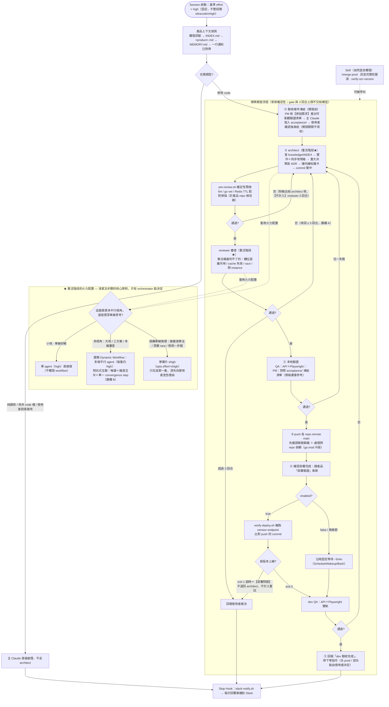

# 工作流程圖

這張圖是 [`CLAUDE.md`](CLAUDE.md) 裡「編排協定 + 標準開發流程（步驟 0~5）」的視覺化版本，方便一眼看懂主 Claude（orchestrator）如何從 session 啟動、任務分流、驗收凍結、pre-review 預檢、五步驟開發、事件驅動部署驗證到火力配置與收尾。內容以 `CLAUDE.md` 為準；兩者若有出入，一律以 `CLAUDE.md` 文字規範為單一真相。

